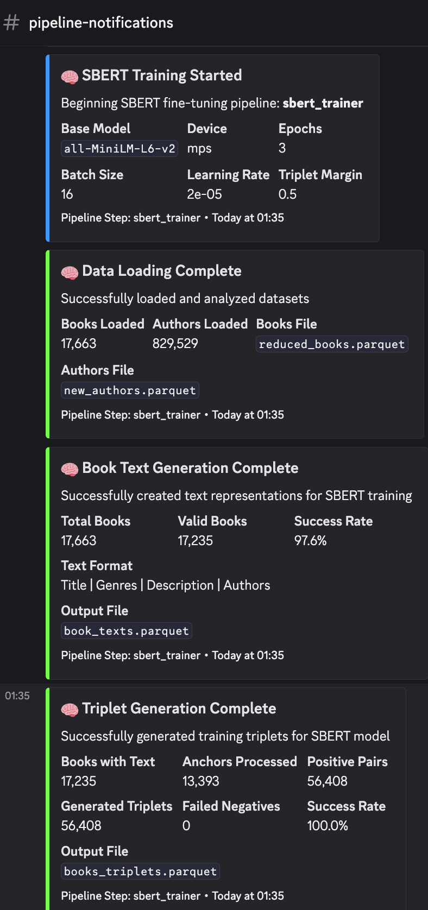

# BookDB
<video src="https://assets.amirghofran.com/amirghofran-com-astro-public/bookdb-vid1.mp4" />
This project aims to design and implement a book recommendation system using Machine Learning. The models will then be used in a consumer-facing web application to recommend books to users based on their reading history.
## Poster & Report

[Report](report.pdf)

## Tech Stack

- Python (for the ML pipeline)
- FastAPI (service that exposes the ML models to the web-app)
- React (frontend for web-app)
- Go (backend for web-app)
- Qdrant (for storing book and user embeddings)
- Postgres (for storing user data and book metadata)
- Docker (for containerization)

## Dataset
This project mainly uses the book metadata and user-book interactions datasets from Goodreads, available at [Goodreads Dataset](https://cseweb.ucsd.edu/~jmcauley/datasets/goodreads.html#datasets). Other datasets regarding authors, book_works, and csv id mapping files were used in preprocessing to prepare the data for training the models.

The required datasets are automatically downloaded into the `data` directory if they are not already present in the first stage of the pipeline (data preprocessing).

## Model
### Content-based Filtering
The best-performing model for content-based filtering is our finetuned SBERT model at `sbert-output` which is used in the pipeline to generate book embeddings in `embeddings/sbert_embeddings.parquet` which are later uploaded to a Qdrant collection to be used for similarity search (using cosine similarity as the similarity metric).

### Collaborative Filtering
The best-performing model for collaborative filtering surprisingly turned out to be the Generalize Matrix Factorization model which was used in the pipeline to generate user and item embeddings in `embeddings/gmf_user_embeddings.parquet` and `embeddings/gmf_item_embeddings.parquet` respectively. These embeddings are later saved to Qdrant collections to be used for similarity search (using the dot product as the similarity metric).

### Cross-Encoder
For the reranking stage, even though we didn't get the chance to integrate it into the pipeline, we finetuned a cross-encoder model available in the  [reranker](reranker) directory.

## Training and tuning
The entire pipeline from downloading the dataset to training the models and saving the embeddings is orchestrated by the [main.py](main.py) script. You just have to set up your python environment, install the dependencies, and run the script.

## Inference
Since we were able to export static embeddings from both of our models, we saved them to Qdrant and queried them from the [Go backend](website/backend) to produce recommendations.

## Design and Development
After experimentation and exploration in jupyter notebooks, we created object-oriented pipeline step classes in the [pipeline](pipeline) directory to make the code more modular and easier to maintain. Then, in the main script, we created a pipeline object that orchestrates the steps and runs the pipeline.

The configuration of the pipeline is set in [pipeline/config.py](pipeline/config.py) and can be changed easily.

We iterated on a pytorch implementation of Neural Collaborative Filtering (NCF) model in the [neural-collaborative-filtering](neural-collaborative-filtering) directory.

We also created a Discord notifier function to send notifications to a Discord channel at different stages of the pipeline.

