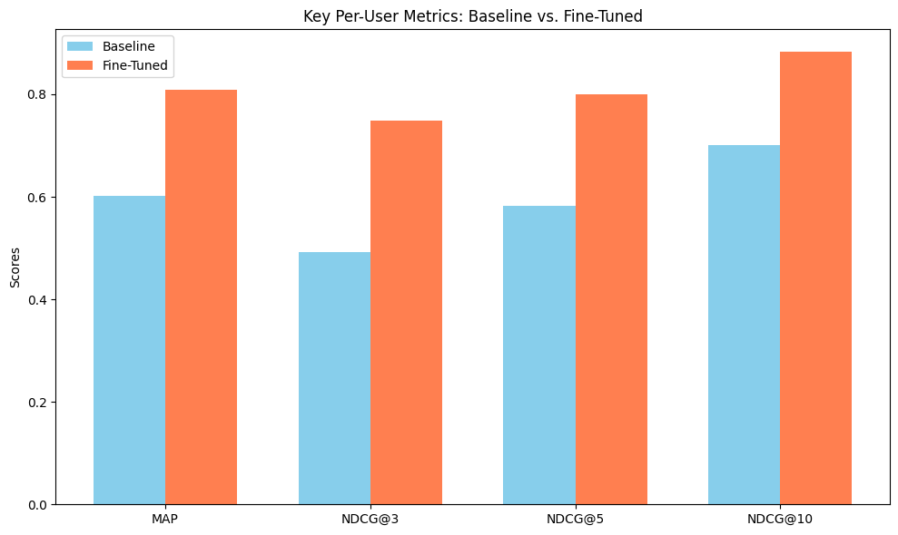

# Reranker

Nowadays, no modern recommendation systems rely solely on a single model to provide user recommendations. Most use a two-stage architecture:

1.  **Retrieval:** Retrieving a broad set of candidates using a swift, low-inference-cost model.
2.  **Reranking:** Reranking the smaller, retrieved set using richer features or heavier, more computationally intensive models.

This reranking process enables the system to provide the most relevant and personalized recommendations, while also allowing for the enforcement of business rules and the preservation of low latency. In our case, we utilize GMF (Generalized Matrix Factorization) embeddings to quickly generate candidates, apply custom logic to improve recommendation diversity, and finally employ a powerful BERT-style cross-encoder to rerank the pruned set of candidates.

In this section, I will outline our approach to reranking, including the custom logic applied as well as the cross-encoder reranking model. For brevity, candidate generation will be omitted as it was covered extensively earlier in this report.

## Custom Logic for Filtering and Diversity

Before engaging our powerful cross-encoder model, we initially apply fast, deterministic rules to refine the candidate set. These rules include:

*   **Filtering:** Removing books already read by the user and eliminating duplicate titles from the candidate list.
*   **Maximal Marginal Relevance (MMR):** Greedily selecting a subset of candidates that balances relevance (to the user) and novelty (in terms of genres/authors). This helps ensure diversity in the shortened candidate list presented for reranking.

During testing, we observed instances where the model would recommend duplicates, which necessitated their removal. An additional check ensures that recommended books are not ones the user has previously interacted with.

Furthermore, we noticed that the model sometimes recommended books that were overly similar (e.g., all from the same author or genre), which could reduce the perceived quality of recommendations. A simple greedy algorithm based on MMR helped address this issue without requiring alterations to our primary recommendation models.

These rules allow us to further prune the list of candidates and improve the overall quality and diversity of the recommendations.

## Model Selection Rationale

As many reranking models can require heavy computation and the reranker was a secondary component of our project, our choice of model was guided by information from existing literature and our specific data constraints.

| Method                      | Pros                                                      | Cons                                                     |
| :-------------------------- | :-------------------------------------------------------- | :------------------------------------------------------- |
| Rule-based/MMR Only       | Hard constraints; diversity; easy to implement          | No learning capacity                                     |
| LightGBM (LambdaMART)       | Millisecond inference; interpretable                      | Heavy feature engineering required; worse reranking performance |
| **Cross-Encoder (Chosen)**  | **Deep query–document interactions; end-to-end learning** | **High per-pair inference cost (mitigated by pre-filtering)** |

We opted against a simple rule-based reranking system as our sole reranking step due to its lack of learning capabilities, which are crucial for improving recommendation quality over time. However, rule-based logic has still proven useful as part of the overarching reranking pipeline.

Additionally, we explored other reranking models, such as LightGBM for a shallow learning option, and other deep neural network-based approaches. A primary challenge we encountered was the lack of extensive user metadata features in our dataset, which many of these models rely on for optimal performance.

A **cross-encoder** offers the strongest ranking quality by jointly attending over user context and book text, enabling it to capture subtle semantic and lexical matches that other methods might miss. It is a considerably more powerful model than the others we investigated and is widely considered an industry standard for high-performance reranking. A key benefit is its ability to achieve strong results with minimal explicit feature engineering, allowing it to learn effectively from the raw textual data available to us. Since we are only reranking an already limited set of candidates generated by the GMF model, the higher per-pair inference cost of a cross-encoder is acceptable within our system's latency constraints.

### Why `ms-marco-MiniLM-L-6-v2`?

The `ms-marco-MiniLM-L-6-v2` model was selected as it is well-suited for our use case. It was distilled from a larger BERT model using the MS MARCO passage ranking dataset, meaning its attention patterns are already optimized for relevance judgments. The model's effectiveness was evident during baseline testing, where it demonstrated good performance on our dataset even before fine-tuning.

Additional reasons for choosing this specific model include:

*   **Speed-Quality Trade-off:** The model is approximately 60 MB, significantly smaller than BERT-base (around 420 MB), while still delivering a substantial portion of the full BERT model's performance.
*   **Efficient Fine-Tuning:** Our testing validated that adaptation on our 250,000 example dataset could be completed effectively within only 2-3 epochs.
*   **Resource-Fit for MLOps:** The small 60MB model artifact can be easily packaged into a containerized inference service, facilitating deployment and maintenance once the system is operational.

## Feature Engineering

Cross-encoders used for reranking require query-document pairs. In our context, this translates to a user description (the "query") and a book description (the "document"), along with a binary label indicating whether the user liked the book. Book descriptions were already available from earlier BERT fine-tuning efforts, but user descriptions needed to be constructed.

### User Context Construction

For each user, a textual context was constructed by summarizing:
*   Their top-rated books (titles and authors).
*   Their top three most frequent genres based on their reading history.

These pieces of information were combined to create a user description. Ideally, more comprehensive user metadata (e.g., age, nationality) would be included, but this data was not available in our dataset. This remains an area for future improvement. Despite this limitation, fine-tuning results demonstrated that the constructed contexts provided sufficient information for the model to adapt effectively to our dataset.

### Challenge: Positive-Only Feedback

Our dataset primarily contains explicit positive signals (books rated ≥4 by users). Explicit "dislike" signals are absent. To address this, we generated negative examples by sampling from unobserved interactions (books the user has not rated) rather than relying on true "0" labels. We employed a per-positive negative sampling strategy with a 1:3 ratio: for each positive (user, book) pair, we sampled three random books that the user had never rated to serve as negative examples. A 1:3 ratio was chosen to balance the need for contrastive signals (more negatives can help the model learn a clearer decision boundary) without overwhelming the positive examples or excessively ballooning the dataset size.

*Future Work:* We plan to incorporate "hard negatives" – challenging negative examples mined from SBERT/CF near-misses – to further sharpen the model's discriminative capabilities.

### Challenge: Context Leakage

Since our user context strings list favorite titles, including the candidate book's title directly in the context for that same book would allow the cross-encoder to "cheat" by simply matching strings. To prevent this, we implemented a **leave-one-out context** strategy. For each training example `(user, candidate_book, label)`, the user context string was rebuilt by *excluding* the `candidate_book` from the list of their favorite books. This forces the model to learn genuine taste signals (based on other preferred genres, authors, and writing styles) rather than relying on trivial string-matching.

### Challenge: Data Size and Computational Constraints

We faced constraints related to input length limits for the model, the large scale of our interaction data, and available computational resources. To manage this:
*   User contexts were capped to include the top 3 "Title by Author" entries plus the top three genres.
*   Book descriptions were automatically truncated to fit within the 384 BPE (Byte Pair Encoding) token limit of the model, aiming to preserve key signals.
*   To balance dataset size against training speed, we randomly subsampled 50,000 positive interactions and generated three negative examples for each, resulting in approximately 200,000 total training instances. This regime was chosen to maximize fine-tuning performance without inducing overfitting.
*   Users were split into 80/10/10 (train/validation/test) sets by user ID to ensure zero leakage of user information between the sets.
*   We ensured that, on average, only about 3 positive examples (and consequently 9 negative examples) per user were included in the final training set. This maintained around 20,000 - 30,000 unique user contexts, providing sufficient diversity for the model to learn generalizable patterns and avoid overfitting.

## Fine-Tuning Results

The provided chart clearly demonstrates a substantial and consistent improvement in the reranker model's performance after fine-tuning, across all evaluated metrics.

**Analysis of Fine-Tuning Impact:**

The fine-tuning process yielded significant gains:

*   **Global ROC AUC** increased from 0.6067 to **0.8478**, indicating a markedly improved ability of the model to discriminate between relevant and irrelevant items on a global scale.
*   **Global Average Precision (AP)** saw a dramatic rise from 0.4237 to **0.7084**. This metric is crucial for ranking tasks, and such a large improvement suggests the fine-tuned model is much better at placing relevant items higher in its rankings.
*   **Mean Average Precision (MAP)** improved from 0.6011 to **0.8087**, reinforcing the conclusion from Global AP that the model's ranking quality for the entire dataset has been considerably enhanced.
*   **NDCG (Normalized Discounted Cumulative Gain)** scores, which measure top-k ranking quality, also showed strong improvements:
    *   NDCG@3: 0.4928 to **0.7478**
    *   NDCG@5: 0.5826 to **0.7992**
    *   NDCG@10: 0.7014 to **0.8826**

These gains highlight the model's enhanced capability to present the most relevant items within the crucial top positions of a recommendation list. They also validate key decisions made during the feature engineering stages:

1.  **User Context Representation:** The fine-tuned model's improved ability to understand relevance implies that the constructed contextual features provided meaningful signals. This was a concern given the limited user information available.
2.  **Item (Book) Representation:** The features selected to represent books (e.g., titles, authors, genres, and descriptive text) were sufficiently informative. The model's improved performance suggests it learned to effectively match user context to these book features.
3.  **Training Data Generation:** The process of creating positive and negative pairs for fine-tuning was successful. The significant improvement implies that the training examples, particularly the selection and construction of negative samples and the leave-one-out context strategy, allowed the model to learn the nuanced differences between relevant and less-relevant items for specific user contexts. The downsampling strategy also did not appear to unduly hinder performance, as the model still improved significantly when tuned.

Additionally, our choice of model architecture was affirmed by the fine-tuning results:

1.  **Cross-Encoder Architecture:** The selection of a cross-encoder model was appropriate for this reranking task, and the performance gains confirm its capacity to learn complex relevance patterns when fine-tuned on domain-specific data.
2.  **Pre-trained Language Model Base:** The results demonstrate that this approach successfully adapted the general linguistic understanding of the pre-trained `ms-marco-MiniLM-L-6-v2` model to the specific nuances of the book recommendation domain.

In conclusion, the fine-tuning process has transformed the reranker into a much more effective component of our recommendation system. The impressive gains across all metrics validate the hypothesis that the chosen features were rich and informative, and that the cross-encoder model, when properly fine-tuned, is a powerful tool for this recommendation reranking task.

---
