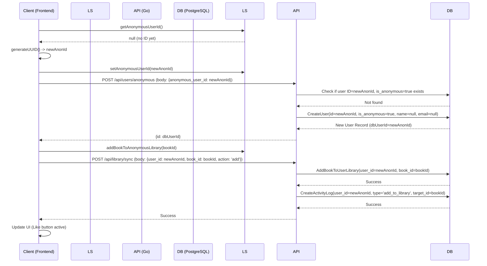
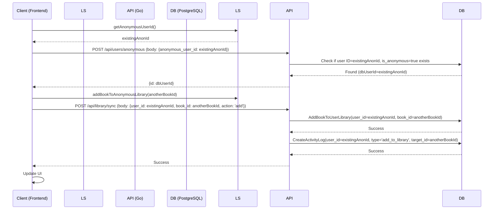
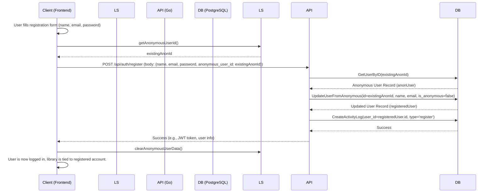

# Anonymous User Library Feature Plan

**Objective:** Implement a feature allowing anonymous users to "like" books, persist this library in `localStorage`, and sync it with the backend. Allow anonymous users to later sign up and merge their library with their registered account.

## 1. Frontend Changes

### 1.1. Anonymous User Identification & `localStorage` Management

*   **Create `website/frontend/src/lib/anonymousUser.ts` (or similar):**
    *   This file will house logic for managing the anonymous user ID and their library in `localStorage`.
    *   **Dependencies:** Install `uuid` package (`npm install uuid && npm install --save-dev @types/uuid`).

    ```typescript
    // website/frontend/src/lib/anonymousUser.ts
    import { v4 as uuidv4 } from 'uuid';

    const ANONYMOUS_USER_ID_KEY = 'anonymousUserId';
    const ANONYMOUS_USER_LIBRARY_KEY = 'anonymousUserLibrary';

    // Anonymous User ID
    export function getAnonymousUserId(): string | null {
        return localStorage.getItem(ANONYMOUS_USER_ID_KEY);
    }

    export function ensureAnonymousUserId(): string {
        let userId = getAnonymousUserId();
        if (!userId) {
            userId = uuidv4();
            localStorage.setItem(ANONYMOUS_USER_ID_KEY, userId);
            // Optionally: Inform the backend about this new anonymous user
            // This can be done here or when the first library action occurs
            // For now, we'll let the first library action trigger backend user creation.
        }
        return userId;
    }

    export function clearAnonymousUserData(): void {
        localStorage.removeItem(ANONYMOUS_USER_ID_KEY);
        localStorage.removeItem(ANONYMOUS_USER_LIBRARY_KEY);
    }

    // Anonymous User Library (Book IDs)
    export function getAnonymousUserLibrary(): string[] {
        const library = localStorage.getItem(ANONYMOUS_USER_LIBRARY_KEY);
        return library ? JSON.parse(library) : [];
    }

    export function setAnonymousUserLibrary(bookIds: string[]): void {
        localStorage.setItem(ANONYMOUS_USER_LIBRARY_KEY, JSON.stringify(bookIds));
    }

    export function addBookToAnonymousLibrary(bookId: string): void {
        const library = getAnonymousUserLibrary();
        if (!library.includes(bookId)) {
            const newLibrary = [...library, bookId];
            setAnonymousUserLibrary(newLibrary);
        }
    }

    export function removeBookFromAnonymousLibrary(bookId: string): void {
        const library = getAnonymousUserLibrary();
        const newLibrary = library.filter(id => id !== bookId);
        setAnonymousUserLibrary(newLibrary);
    }

    export function isBookInAnonymousLibrary(bookId: string): boolean {
        const library = getAnonymousUserLibrary();
        return library.includes(bookId);
    }
    ```

### 1.2. API Client Updates (`website/frontend/src/lib/api.ts`)

*   Add functions to call new backend endpoints.

    ```typescript
    // website/frontend/src/lib/api.ts
    // ... existing imports and functions

    export async function ensureBackendAnonymousUser(anonymousUserId: string): Promise<{ id: string }> {
        const response = await fetch('/api/users/anonymous', {
            method: 'POST',
            headers: { 'Content-Type': 'application/json' },
            body: JSON.stringify({ anonymous_user_id: anonymousUserId }),
        });
        if (!response.ok) {
            // Basic error handling for now
            console.error('Failed to ensure backend anonymous user', await response.text());
            throw new Error('Failed to ensure backend anonymous user');
        }
        return response.json();
    }

    export async function syncAnonymousLibraryItem(userId: string, bookId: string, action: 'add' | 'remove'): Promise<void> {
        // Assuming a single sync endpoint for simplicity, could be separate add/remove
        const response = await fetch('/api/library/sync', {
            method: 'POST',
            headers: { 'Content-Type': 'application/json' },
            body: JSON.stringify({ user_id: userId, book_id: bookId, action }),
        });
        if (!response.ok) {
            console.error(`Failed to ${action} book ${bookId} for user ${userId}`, await response.text());
            throw new Error(`Failed to ${action} book in library`);
        }
    }

    // Modify the existing registration function if one exists, or create a new one
    // to include anonymous_user_id
    export async function registerUser(userData: any, anonymousUserId?: string | null): Promise<any> {
        const payload = anonymousUserId ? { ...userData, anonymous_user_id: anonymousUserId } : userData;
        const response = await fetch('/api/auth/register', { // Assuming this is your registration endpoint
            method: 'POST',
            headers: { 'Content-Type': 'application/json' },
            body: JSON.stringify(payload),
        });
        if (!response.ok) {
            console.error('Registration failed', await response.text());
            throw new Error('Registration failed');
        }
        return response.json();
    }
    ```

### 1.3. UI Integration

*   **Modify Like/Add to Library Buttons:**
    *   In `book-card.tsx` and `website/frontend/src/routes/books.$id.tsx`.
    *   When a user (anonymous or logged in) clicks the button:
        1.  If user is logged in, use existing logic (presumably calling an API with their auth token).
        2.  If user is anonymous:
            *   Call `ensureAnonymousUserId()` to get/create the ID.
            *   Call `ensureBackendAnonymousUser(anonymousUserId)` to make sure the backend knows about this user.
            *   Update `localStorage` using `addBookToAnonymousLibrary` or `removeBookFromAnonymousLibrary`.
            *   Call `syncAnonymousLibraryItem(anonymousUserId, bookId, action)` to inform the backend.
            *   Update the button's visual state (e.g., filled/unfilled heart).

    *Example (conceptual for a like button):*
    ```tsx
    // In a component like BookCard.tsx
    import { useState, useEffect } from 'react';
    import {
        ensureAnonymousUserId,
        isBookInAnonymousLibrary,
        addBookToAnonymousLibrary,
        removeBookFromAnonymousLibrary,
        getAnonymousUserId
    } from '@/lib/anonymousUser'; // Adjust path
    import { ensureBackendAnonymousUser, syncAnonymousLibraryItem } from '@/lib/api'; // Adjust path
    // Assume useAuth() hook provides logged-in user state
    // import { useAuth } from '@/hooks/useAuth';

    // ... component props include bookId

    // const { user } = useAuth(); // Example auth hook
    const isUserLoggedIn = false; // Replace with actual auth check

    const [isLiked, setIsLiked] = useState(false);

    useEffect(() => {
        if (!isUserLoggedIn) {
            const bookId = "your_book_id"; // Get bookId from props
            setIsLiked(isBookInAnonymousLibrary(bookId));
        } else {
            // Fetch liked status for logged-in user
        }
    }, [isUserLoggedIn /*, bookId, user */]);

    const handleLikeToggle = async () => {
        const bookId = "your_book_id"; // Get bookId from props
        if (!isUserLoggedIn) {
            const anonymousUserId = ensureAnonymousUserId();
            try {
                await ensureBackendAnonymousUser(anonymousUserId); // Ensure backend user exists
                const currentlyLiked = isBookInAnonymousLibrary(bookId);
                if (currentlyLiked) {
                    removeBookFromAnonymousLibrary(bookId);
                    await syncAnonymousLibraryItem(anonymousUserId, bookId, 'remove');
                    setIsLiked(false);
                } else {
                    addBookToAnonymousLibrary(bookId);
                    await syncAnonymousLibraryItem(anonymousUserId, bookId, 'add');
                    setIsLiked(true);
                }
            } catch (error) {
                console.error("Failed to sync like status:", error);
                // Optionally revert UI change or show error to user
            }
        } else {
            // Handle like toggle for logged-in user via API
        }
    };
    // ... render button with onClick={handleLikeToggle} and style based on isLiked
    ```

### 1.4. Registration Flow Update

*   When a user navigates to the registration page/modal:
    *   Check if an `anonymousUserId` exists using `getAnonymousUserId()`.
    *   If it exists, pass this ID along with the registration form data to the `registerUser` API call.
*   After successful registration where an anonymous ID was merged:
    *   Call `clearAnonymousUserData()` to remove the anonymous ID and library from `localStorage`.

### 1.5. App Load/Initialization

*   In your main app component (e.g., `__root.tsx` or `main.tsx`):
    *   On initial load, if the user is not logged in:
        *   Call `const anonId = getAnonymousUserId();`
        *   If `anonId` exists, call `ensureBackendAnonymousUser(anonId);` to ensure the backend is aware of this anonymous user. This can be done silently.

## 2. Backend Changes (Go & PostgreSQL)

### 2.1. Database Migration (New file: `website/backend/sql/migrations/0002_anonymous_users.sql`)

```sql
-- +goose Up
-- Modify Users Table for Anonymous Users
ALTER TABLE Users
ADD COLUMN IF NOT EXISTS is_anonymous BOOLEAN DEFAULT FALSE,
ALTER COLUMN email DROP NOT NULL,
ALTER COLUMN name DROP NOT NULL;

-- Add a specific anonymous user for activity logging if needed,
-- or rely on the frontend to create anonymous users on demand.
-- For the chosen approach (placeholder user for activity logging):
-- We will create anonymous users on-demand via an API endpoint.
-- The `user_id` in `ActivityLogs` can then point to these anonymous user records.

-- Update existing users to not be anonymous
UPDATE Users SET is_anonymous = FALSE WHERE is_anonymous IS NULL;


-- +goose Down
ALTER TABLE Users
DROP COLUMN IF EXISTS is_anonymous,
ALTER COLUMN email SET NOT NULL, -- This might fail if there are NULL emails from anonymous users not cleaned up
ALTER COLUMN name SET NOT NULL;  -- This might fail if there are NULL names

-- Note: Reverting NOT NULL constraints requires handling any NULL values
-- that might have been introduced for anonymous users.
-- A more robust down migration would handle this, e.g., by deleting anonymous users
-- or setting placeholder values before re-applying NOT NULL.
-- For simplicity, this down migration assumes such cleanup or accepts potential failure.
```

### 2.2. Update `sqlc` Models

*   Run `sqlc generate` in the `website/backend` directory to update Go models based on the schema changes. This will affect `website/backend/internal/db/models.go` and related query files.

### 2.3. API Handlers (`website/backend/internal/api/handlers/`)

*   **Create `website/backend/internal/api/handlers/anonymous.go` (or add to existing user handlers):**

    ```go
    // website/backend/internal/api/handlers/anonymous.go
    package handlers

    import (
        "net/http"
        "time"

        "github.com/gin-gonic/gin"
        "github.com/google/uuid"
        "github.com/yamirghofran/BookDB/internal/db" // Adjust import path
    )

    type AnonymousUserRequest struct {
        AnonymousUserID string `json:"anonymous_user_id" binding:"required,uuid"`
    }

    func (h *Handler) EnsureAnonymousUser(c *gin.Context) {
        var req AnonymousUserRequest
        if err := c.ShouldBindJSON(&req); err != nil {
            c.JSON(http.StatusBadRequest, gin.H{"error": "Invalid request: " + err.Error()})
            return
        }

        parsedUserID, err := uuid.Parse(req.AnonymousUserID)
        if err != nil {
            c.JSON(http.StatusBadRequest, gin.H{"error": "Invalid anonymous_user_id format"})
            return
        }

        // Check if anonymous user already exists
        user, err := h.Queries.GetUserByID(c.Request.Context(), parsedUserID)
        if err == nil && user.IsAnonymous.Bool { // Found existing anonymous user
            c.JSON(http.StatusOK, gin.H{"id": user.ID.String()})
            return
        }
        
        // If user exists but is NOT anonymous, this is an issue (ID collision)
        // For now, we'll assume UUIDs are unique enough to avoid this with registered users.
        // A more robust check might be needed if non-anonymous users could have arbitrary UUIDs.

        // Create new anonymous user
        // Use db.CreateUserParams and ensure IsAnonymous is set to true
        // Name and Email can be nil or have placeholder values if your DB schema requires them
        // For now, assuming name and email are nullable as per migration.
        
        createUserParams := db.CreateUserParams{
            ID:          parsedUserID,
            IsAnonymous: db.NewNullBool(true), // sqlc will generate NewNullBool for nullable booleans
            // Name and Email will be NULL by default if not provided and columns are nullable
            // NcfID might also need to be handled (e.g., nullable or a special value)
        }

        newUser, err := h.Queries.CreateUser(c.Request.Context(), createUserParams)
        if err != nil {
            c.JSON(http.StatusInternalServerError, gin.H{"error": "Failed to create anonymous user: " + err.Error()})
            return
        }

        c.JSON(http.StatusCreated, gin.H{"id": newUser.ID.String()})
    }
    ```

*   **Create/Modify Library Sync Handler (e.g., `website/backend/internal/api/handlers/library.go`):**

    ```go
    // website/backend/internal/api/handlers/library.go
    package handlers

    import (
        "net/http"
        "time"

        "github.com/gin-gonic/gin"
        "github.com/google/uuid"
        "github.com/yamirghofran/BookDB/internal/db" // Adjust import path
    )

    type SyncLibraryRequest struct {
        UserID string `json:"user_id" binding:"required,uuid"`
        BookID string `json:"book_id" binding:"required,uuid"`
        Action string `json:"action" binding:"required,oneof=add remove"` // 'add' or 'remove'
    }

    func (h *Handler) SyncLibraryItem(c *gin.Context) {
        var req SyncLibraryRequest
        if err := c.ShouldBindJSON(&req); err != nil {
            c.JSON(http.StatusBadRequest, gin.H{"error": "Invalid request: " + err.Error()})
            return
        }

        userID, err := uuid.Parse(req.UserID)
        if err != nil {
            c.JSON(http.StatusBadRequest, gin.H{"error": "Invalid user_id format"})
            return
        }
        bookID, err := uuid.Parse(req.BookID)
        if err != nil {
            c.JSON(http.StatusBadRequest, gin.H{"error": "Invalid book_id format"})
            return
        }

        // Verify user exists (could be anonymous or registered)
        _, err = h.Queries.GetUserByID(c.Request.Context(), userID)
        if err != nil {
            // Consider if we should create anonymous user here if not found,
            // or rely on /api/users/anonymous endpoint.
            // For now, assume user (anonymous or registered) already exists.
            c.JSON(http.StatusNotFound, gin.H{"error": "User not found"})
            return
        }
        
        // Verify book exists
         _, err = h.Queries.GetBook(c.Request.Context(), bookID) // Assuming GetBook query exists
         if err != nil {
            c.JSON(http.StatusNotFound, gin.H{"error": "Book not found"})
            return
         }


        ctx := c.Request.Context()
        var activityType db.UserActivityType

        if req.Action == "add" {
            activityType = db.UserActivityTypeAddToLibrary
            params := db.AddBookToUserLibraryParams{
                UserID: userID,
                BookID: bookID,
                // AddedAt will be default CURRENT_TIMESTAMP
            }
            // Check if already in library to avoid duplicate error, or handle error
            _, err := h.Queries.GetBookFromUserLibrary(ctx, db.GetBookFromUserLibraryParams{UserID: userID, BookID: bookID})
            if err == nil { // Already exists
                 c.JSON(http.StatusOK, gin.H{"message": "Book already in library"})
                 return
            }

            if err != nil && err.Error() != "no rows in result set" { // some other error
                c.JSON(http.StatusInternalServerError, gin.H{"error": "Error checking library: " + err.Error()})
                return
            }
            
            // Not in library, add it
            if _, err := h.Queries.AddBookToUserLibrary(ctx, params); err != nil {
                c.JSON(http.StatusInternalServerError, gin.H{"error": "Failed to add book to library: " + err.Error()})
                return
            }
        } else if req.Action == "remove" {
            activityType = db.UserActivityTypeRemoveFromLibrary
            params := db.RemoveBookFromUserLibraryParams{
                UserID: userID,
                BookID: bookID,
            }
            if err := h.Queries.RemoveBookFromUserLibrary(ctx, params); err != nil {
                c.JSON(http.StatusInternalServerError, gin.H{"error": "Failed to remove book from library: " + err.Error()})
                return
            }
        } else {
            c.JSON(http.StatusBadRequest, gin.H{"error": "Invalid action"})
            return
        }

        // Log activity
        logParams := db.CreateActivityLogParams{
            UserID:       db.NewNullUUID(userID), // sqlc will generate NewNullUUID
            ActivityType: activityType,
            TargetID:     db.NewNullUUID(bookID), // Storing book_id as target_id
            // Details: can be nil or additional JSONB data
        }
        if _, err := h.Queries.CreateActivityLog(ctx, logParams); err != nil {
            // Log this error on the server, but don't fail the user request for it
            // For example: log.Printf("Failed to create activity log: %v", err)
        }

        c.JSON(http.StatusOK, gin.H{"message": "Library updated successfully"})
    }
    ```

*   **Modify Registration Handler (e.g., in `website/backend/internal/api/handlers/auth.go`):**

    ```go
    // website/backend/internal/api/handlers/auth.go
    package handlers

    import (
        // ... other imports
        "github.com/google/uuid"
        "github.com/yamirghofran/BookDB/internal/db" // Adjust
    )

    type RegisterRequest struct {
        Name            string `json:"name" binding:"required"`
        Email           string `json:"email" binding:"required,email"`
        Password        string `json:"password" binding:"required,min=8"`
        AnonymousUserID string `json:"anonymous_user_id,omitempty"` // Optional
    }

    func (h *Handler) RegisterUser(c *gin.Context) {
        var req RegisterRequest
        if err := c.ShouldBindJSON(&req); err != nil {
            c.JSON(http.StatusBadRequest, gin.H{"error": "Invalid request: " + err.Error()})
            return
        }

        ctx := c.Request.Context()

        // Hashing password logic (ensure this exists and is secure)
        // hashedPassword, err := hashPassword(req.Password)
        // if err != nil {
        //    c.JSON(http.StatusInternalServerError, gin.H{"error": "Failed to hash password"})
        //    return
        // }

        var finalUserID uuid.UUID
        var newUser db.User
        var err error

        if req.AnonymousUserID != "" {
            anonUUID, parseErr := uuid.Parse(req.AnonymousUserID)
            if parseErr != nil {
                c.JSON(http.StatusBadRequest, gin.H{"error": "Invalid anonymous_user_id format"})
                return
            }

            // Try to find the anonymous user
            anonUser, getErr := h.Queries.GetUserByID(ctx, anonUUID)
            if getErr == nil && anonUser.IsAnonymous.Bool {
                // Anonymous user found, update them to be a registered user
                updateParams := db.UpdateUserFromAnonymousParams{ // This query needs to be defined in users.sql
                    ID:          anonUser.ID,
                    Name:        db.NewNullString(req.Name),
                    Email:       db.NewNullString(req.Email),
                    // PasswordHash: db.NewNullString(hashedPassword), // Assuming you store hashed passwords
                    IsAnonymous: db.NewNullBool(false),
                    UpdatedAt:   db.NewNullTime(time.Now()),
                }
                updatedUser, updateErr := h.Queries.UpdateUserFromAnonymous(ctx, updateParams)
                if updateErr != nil {
                    c.JSON(http.StatusInternalServerError, gin.H{"error": "Failed to update anonymous user: " + updateErr.Error()})
                    return
                }
                newUser = updatedUser
                finalUserID = newUser.ID
            } else {
                // Anonymous user not found or not actually anonymous, proceed to create new
                // Or return an error if this case is unexpected
            }
        }

        if finalUserID == uuid.Nil { // If not updated from anonymous, create new
            // Check if email already exists for a non-anonymous user
            existingUser, _ := h.Queries.GetUserByEmail(ctx, req.Email) // Assuming GetUserByEmail query exists
            if existingUser.ID != uuid.Nil && !existingUser.IsAnonymous.Bool {
                 c.JSON(http.StatusConflict, gin.H{"error": "Email already registered"})
                 return
            }

            createParams := db.CreateUserParams{
                ID:          uuid.New(), // Generate new UUID for new registered user
                Name:        db.NewNullString(req.Name),
                Email:       db.NewNullString(req.Email),
                // PasswordHash: db.NewNullString(hashedPassword),
                IsAnonymous: db.NewNullBool(false),
                // NcfID: needs to be handled
            }
            createdUser, createErr := h.Queries.CreateUser(ctx, createParams)
            if createErr != nil {
                c.JSON(http.StatusInternalServerError, gin.H{"error": "Failed to create user: " + createErr.Error()})
                return
            }
            newUser = createdUser
            finalUserID = newUser.ID
        }
        
        // Log registration activity
        logParams := db.CreateActivityLogParams{
            UserID:       db.NewNullUUID(finalUserID),
            ActivityType: db.UserActivityTypeRegister,
        }
        _, logErr := h.Queries.CreateActivityLog(ctx, logParams)
        if logErr != nil {
            // Log server-side
        }


        // JWT token generation and response logic...
        // token, err := generateJWT(newUser.ID.String())
        // if err != nil { ... }
        // c.JSON(http.StatusCreated, gin.H{"token": token, "user_id": newUser.ID.String(), "name": newUser.Name.String})
        c.JSON(http.StatusCreated, gin.H{"message": "User registered successfully", "user_id": finalUserID.String()})
    }
    ```

### 2.4. SQL Queries (`website/backend/sql/queries/`)

*   **`users.sql`:**
    *   Add `CreateUser` if it doesn't fully support `is_anonymous` and nullable fields.
    *   Add `GetUserByID`.
    *   Add `GetUserByEmail`.
    *   Add `UpdateUserFromAnonymous`:
        ```sql
        -- name: UpdateUserFromAnonymous :one
        UPDATE Users
        SET
            name = COALESCE(sqlc.narg(name), name),
            email = COALESCE(sqlc.narg(email), email),
            -- password_hash = COALESCE(sqlc.narg(password_hash), password_hash), -- If you store passwords
            is_anonymous = COALESCE(sqlc.narg(is_anonymous), is_anonymous),
            updated_at = COALESCE(sqlc.narg(updated_at), NOW())
        WHERE id = $1
        RETURNING *;
        ```
    *   Ensure `CreateUser` can handle potentially `NULL` `ncf_id` or set it appropriately.

*   **`user_library.sql`:**
    *   Ensure `AddBookToUserLibrary` and `RemoveBookFromUserLibrary` exist.
    *   Add `GetBookFromUserLibrary`:
        ```sql
        -- name: GetBookFromUserLibrary :one
        SELECT * FROM UserLibrary
        WHERE user_id = $1 AND book_id = $2;
        ```

*   **`activity_logs.sql`:**
    *   Ensure `CreateActivityLog` exists and handles nullable `user_id` and `target_id`.

*   **`books.sql`:**
    *   Ensure `GetBook` (by ID) query exists.


### 2.5. API Routes (`website/backend/internal/api/routes.go`)

```go
// website/backend/internal/api/routes.go
package api

import (
    // ... other imports
    "github.com/yamirghofran/BookDB/internal/api/handlers" // Adjust
    "github.com/yamirghofran/BookDB/internal/db" // Make sure db is imported
)

func SetupRoutes(router *gin.Engine, dbQueries *db.Queries) { // Ensure db.Queries is passed
    // ... existing routes

    handler := handlers.NewHandler(dbQueries) // Assuming NewHandler constructor

    // Anonymous User Route
    router.POST("/api/users/anonymous", handler.EnsureAnonymousUser)

    // Library Sync Route
    router.POST("/api/library/sync", handler.SyncLibraryItem) // Requires auth if user is logged in, or can be open if user_id is anonymous

    // Auth routes (ensure RegisterUser is mapped)
    authRoutes := router.Group("/api/auth")
    {
        // ... other auth routes
        authRoutes.POST("/register", handler.RegisterUser)
    }

    // Potentially, library routes might need middleware to distinguish
    // between authenticated users and anonymous users (identified by a header/body param).
    // For now, SyncLibraryItem takes user_id in the body.
}
```

## 3. Workflow Diagrams

### Anonymous User - First Like Action



### Anonymous User - Subsequent Like Action



### Anonymous User Registers



## 4. Considerations & Future Enhancements

*   **Security:** The `anonymous_user_id` is client-generated and trusted by the backend for initial creation and sync. This is generally acceptable for this type of feature but could be hardened (e.g., backend-issued anonymous tokens).
*   **Error Handling:** The plan outlines basic error logging. Robust user-facing error messages and retry mechanisms would be an improvement.
*   **Offline Support:** The current plan assumes online connectivity for backend sync. True offline liking would require more complex local storage state and a more sophisticated sync strategy.
*   **Data Volume for Anonymous Users:** If many anonymous users only like a few items and never convert, the `Users` table could grow. A cleanup strategy for old, inactive anonymous users might be needed eventually.
*   **`ncf_id` for Anonymous Users:** The plan needs to clarify how `ncf_id` is handled for anonymous users in the `Users` table (e.g., can it be `NULL`? Does it get a temporary value?). The migration makes `email` and `name` nullable, but `ncf_id` is an `INTEGER` and might need similar consideration or a default. For now, assume it can be `NULL` or is not set for anonymous users.

This plan provides a comprehensive approach to implementing the desired anonymous user library functionality.